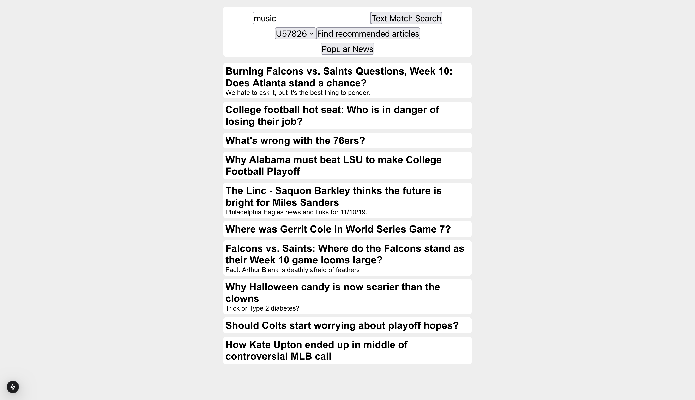

# Vespa News Search and Recommendations

This Hack Pack for TreeHacks 2025 demonstrates basic search and recommendation functionality using Vespa. It is based on Vespa's [News Search and Recommendation tutorial](https://docs.vespa.ai/en/tutorials/news-1-getting-started.html) but has been simplified and modified.



## Overview

This recommendation system uses embeddings for users and news articles. To recommend articles, we calculate the distance between user and article embeddings using a dot product. A higher dot product value indicates a better match.

To generate embeddings for a news article:
1. A BERT model creates an initial 512-dimensional embedding.
2. A neural network reduces it to 50 dimensions.

This approach allows us to create news embeddings without recalculating all other embeddings, since we only need to train the neural network and the user embeddings.

As example data, we use the [MIND dataset](https://msnews.github.io/), which contains news articles and user interactions (clicks and skips). Clicks are treated as positive interactions, while skips indicate weak recommendations.

## Requirements
- [Docker](https://www.docker.com/) or [Podman](https://podman.io/)
- [Vespa CLI](https://docs.vespa.ai/en/vespa-cli.html)
- [UV](https://docs.astral.sh/uv/getting-started/installation/) (Python package manager) or [Python >= 3.12](https://www.python.org/)
- [Node.js](https://nodejs.org/en) (for the frontend)
- [git-lfs](https://git-lfs.com/) (To download pretrained embeddings)

## Setup Instructions

### Clone the Repository
```bash
git clone https://github.com/theodorklauritzen/vespa-news-recommendation-hack-pack.git
```

### Start Vespa Container
```bash
docker run --detach --name vespa --hostname vespa-container \
  --publish 8080:8080 --publish 19071:19071 \
  vespaengine/vespa
```

### Deploy the Vespa Application
```bash
vespa config set target local
vespa status deploy --wait 300
vespa deploy src/application
```

### Start the Frontend
```bash
cd frontend
npm install
npm run dev
```
The frontend will be available at [http://localhost:3000/](http://localhost:3000/).

## Feeding Data to Vespa

To load pretrained data into Vespa:
```bash
git lfs pull
vespa feed embeddings/vespa_user_embeddings.json --target http://localhost:8080
vespa feed embeddings/vespa_news_embeddings.json --target http://localhost:8080
```
Users and news should now be available in the frontend.

### Download the Dataset
To manually process data, download the dataset:
```bash
./src/sh/download_mind.sh demo
```
This creates a `mind` directory with the dataset.

### Set Up Python Environment
```bash
uv sync
source .venv/bin/activate
```
Copy `default.env` to `.env` and update it if your Vespa instance runs on a different host.

### Adding Users
```bash
python src/python/addUser.py id <user_id>
```
To add users from the dataset:
```bash
python src/python/addUser.py mind/train/behaviors.tsv
```

### Adding News Articles
To add a single news article:
```bash
python src/python/addNews.py embeddings/news_bert_transform.pt
```

To add articles from the dataset:
```bash
python src/python/addNews.py embeddings/news_bert_transform.pt mind/train/news.tsv
```

### Generating Recommendations
To compute new embeddings for users and news:
```bash
python src/python/calculateRecommendations.py mind/train/behaviors.tsv mind/dev/behaviors.tsv embeddings/news_bert_transform.pt
```
- The first file is for training.
- The second file is for validation.
- The last file stores transformation weights for future news embeddings.

If a user interacts with more articles, add the interactions to `mind/dev/behaviors.tsv`.
